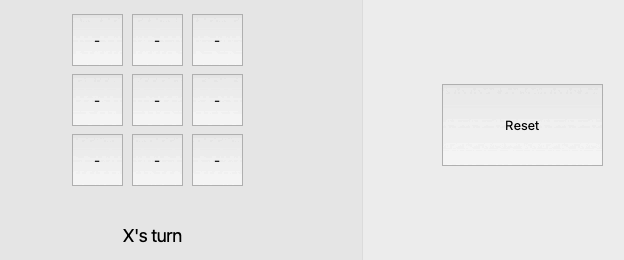

# TIC TAC TOE
A simple Tic Tac Toe game written in Qt. 

<h1> Development environment </h1>
<ul>  
  <li> io/mac </li>
  <li> Qt Creator 6.4.0 </li>
</ul>

<h1> TODO </h1>

<ul>
  <li> <s> Player vs Player Mode </s> </li>
  <li> Player vs Computer Mode </li>
  <li> Game difficulty option 
      <ul> <li> Implement minimax algorithm </li> </ul>
  </li>
  <li> Add 5x5 and 7x7 boards </li>
</ul>

